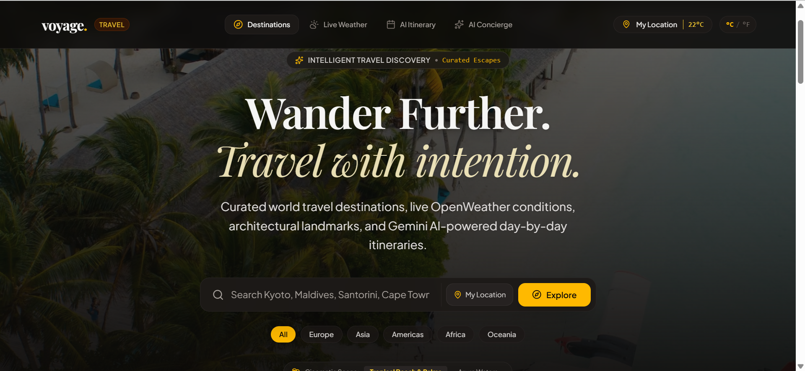
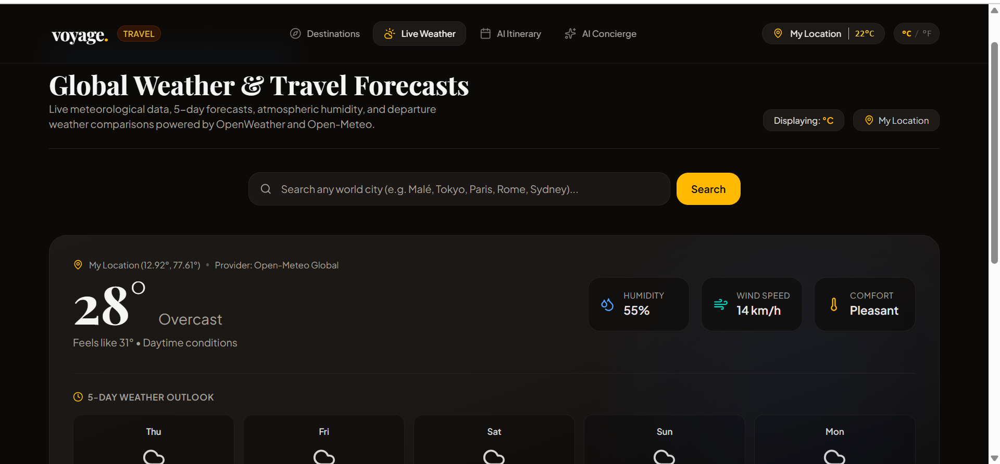
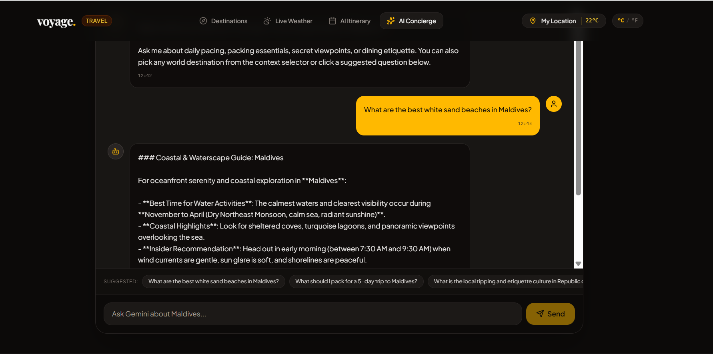
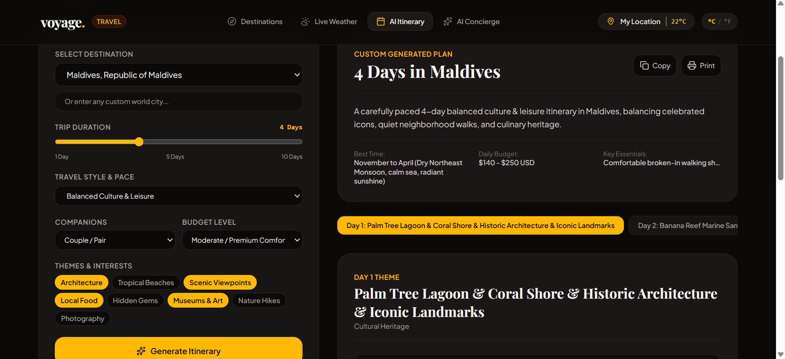

# Voyage – World Travel Discovery & AI Planner

A modern, responsive full-stack travel discovery application built with **React.js**, **TypeScript**, **Tailwind CSS**, and powered by the **Google Gemini API**. 

Voyage enables travelers to explore premier global destinations, check real-time weather forecasts, discover curated landmarks, chat with an intelligent AI travel concierge, and automatically generate detailed, customized multi-day itineraries.

---

## 🚀 Live Demo & Links
- **Live Demo**: [Voyage on Vercel ](https://voyage-travel-app-cyan.vercel.app/)
- **Built with**: React 19, TypeScript, Vite, Express, Tailwind CSS, Google Gemini 2.5 Flash

---

## 💡 Tech Stack & Architecture


- **Frontend**: 
  - **React 19** (Functional components, hooks, modern React architecture)
  - **TypeScript** (Strict type safety, interfaces, data models)
  - **Tailwind CSS v4** (Modern responsive utility styling)
  - **Motion (Framer Motion)** (Smooth animations, card transitions, tab switching)
  - **Lucide React** (Crisp, modern SVG icons)
  - **React Markdown** (Rich formatting for AI concierge and itinerary responses)
- **Backend & Serverless**:
  - **Node.js & Express** (Local development server & API proxy)
  - **Vercel Serverless Functions** (`/api/*` endpoints for cloud deployment)
  - **Vite 6** (Blazing fast build tool and HMR bundler)
- **AI & External APIs**:
  - **Google Gemini API (`@google/genai`)**: Powers the AI Travel Concierge and dynamic day-by-day Itinerary Planner
  - **Open-Meteo Weather API**: Real-time temperature, wind, humidity, UV index, and 5-day weather forecasts
  - **Nominatim OpenStreetMap Geocoding API**: Live coordinate and destination lookup
  - **Curated High-Resolution Photography**: Optimized destination visual galleries

---

## 📸 Screenshots
| Destination Explorer | Live Weather Hub |
| :---: | :---: |
|  |  |

| AI Travel Concierge Chat | Custom Multi-Day Itinerary Planner |
| :---: | :---: |
|  |  |

---

## ✨ Features Built

1. **Global Destination Explorer**:
   - Filter destinations across Asia, Europe, Africa, North America, South America, and Oceania.
   - Search by name, country, tags, vibe (Luxury, Adventure, Cultural, Romantic, Coastal).
   - In-depth destination detail views with language, currency, optimal visit windows, and key landmarks.

2. **AI Travel Concierge**:
   - Conversational assistant powered by Google Gemini (`gemini-2.5-flash`).
   - Context-aware answers regarding packing essentials, local etiquette, transit advice, hidden photo spots, and culinary specialties.
   - Dual-engine architecture: seamless fallback to curated local knowledge if the network or API quota is limited.

3. **Intelligent Day-by-Day Itinerary Planner**:
   - Configurable parameters: destination, duration (1–7 days), travel style (Backpacker, Cultural, Luxury, Relaxed), group size, and dietary/activity interests.
   - Generates structured daily plans with morning, afternoon, evening activities, and recommended culinary tastings.
   - Quick export and copy features for travelers on the go.

4. **Live Weather Hub & Forecasts**:
   - Accurate, real-time meteorological data for any destination via Open-Meteo.
   - Metric/Imperial unit toggling (°C / °F).
   - Dynamic weather condition icons, sunrise/sunset times, wind speed, and humidity indicators.

5. **Curated Photo Galleries**:
   - High-definition photography galleries showcasing iconic sights, street scenes, and landscapes for each destination.

---

## 🔌 APIs Used

| API / Service | Provider | Purpose |
| :--- | :--- | :--- |
| **Google Gemini API** | Google AI Studio | Generates natural language concierge responses and customized day-by-day itineraries. |
| **Open-Meteo API** | Open-Meteo | Provides real-time weather metrics and multi-day meteorological forecasts (no API key required). |
| **Nominatim Geocoding** | OpenStreetMap | Resolves city/region names to latitude and longitude coordinates. |
| **Curated Imagery** | Unsplash Source | Delivers fast, high-resolution destination photography. |

---

## 🛠️ How to Run Locally

### 1. Prerequisites
- **Node.js** (v18.0.0 or higher recommended)
- **npm** or **yarn** / **pnpm**
- A **Google Gemini API Key** (Free from [Google AI Studio](https://aistudio.google.com/apikey))

### 2. Clone the Repository
```bash
git clone https://github.com/YOUR_USERNAME/YOUR_REPOSITORY.git
cd YOUR_REPOSITORY
```

### 3. Install Dependencies
```bash
npm install
```

### 4. Configure Environment Variables
Create a `.env` file in the root directory:
```bash
cp .env.example .env
```
Open `.env` and add your Gemini API key:
```env
GEMINI_API_KEY=your_gemini_api_key_here
```

### 5. Start the Development Server
```bash
npm run dev
```
Open your browser and navigate to:
```
http://localhost:3000
```

---

## 📦 Build for Production

To create an optimized production build:
```bash
npm run build
```
To run the compiled production server locally:
```bash
npm start
```

---

## 🌐 Deploying to Vercel

1. Push your repository to **GitHub**.
2. Import the project into **Vercel** (`https://vercel.com`).
3. Add the environment variable in Vercel settings:
   - **Key**: `GEMINI_API_KEY`
   - **Value**: `Your_Gemini_API_Key`
4. Click **Deploy**. Vercel will automatically configure the serverless functions in `/api` and serve the React client application.

---

## 📄 License
This project is licensed under the MIT License.
